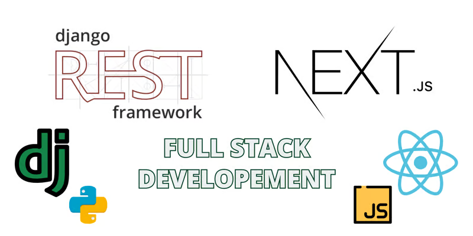

# 🌐 Django & Next.js Project
<div align="center">
  
</div>

<p align="center">
  <a href="https://github.com/seu-usuario/seu-repositorio">
    
  </a>
  <a href="https://github.com/guedes-jr/django_next_auth/issues">
    
  </a>
  <a href="https://github.com/guedes-jr/django_next_auth/network">
    
  </a>
  <a href="https://github.com/guedes-jr/django_next_auth/stargazers">
    
  </a>
  <a href="https://github.com/guedes-jr/django_next_auth/blob/main/LICENSE">
    
  </a>
</p>

## 📝 Sumário

- [Sobre o Projeto](#sobre-o-projeto)
- [Tecnologias Utilizadas](#tecnologias-utilizadas)
- [Funcionalidades](#funcionalidades)
- [Requisitos](#requisitos)
- [Instalação](#instalação)
- [Uso](#uso)
- [Scripts Disponíveis](#scripts-disponíveis)
- [Estrutura de Pastas](#estrutura-de-pastas)
- [Contribuindo](#contribuindo)
- [Licença](#licença)
- [Contato](#contato)

## 🛠️ Sobre o Projeto

Este é um projeto full-stack que combina Django para o back-end e Next.js para o front-end. A aplicação visa fornecer uma plataforma robusta para novos projetos.

## 🧰 Tecnologias Utilizadas

- [Django](https://www.djangoproject.com/) - Back-end framework
- [Next.js](https://nextjs.org/) - React framework para front-end
- [PostgreSQL](https://www.postgresql.org/) - Banco de dados
- [AntDesign](https://ant.design/) - Estilização

## ✨ Funcionalidades

- Autenticação de usuários
- CRUD de novos usuários
- Interface responsiva e moderna
- API interna para comunicação com o frontend

## 📋 Requisitos

- Python 3
- Node.js 14 ou superior
- PostgreSQL

## 🚀 Instalação

### Clonando o Repositório

```bash
git clone https://github.com/guedes-jr/django_next_auth.git backend

cd backend
```

### Configurando o Back-end (Django)

```bash
# Criar ambiente virtual
python3 -m venv venv

# Ativar ambiente virtual
source venv/bin/activate  # No Windows use `venv\Scripts\activate`

# Instalar dependências necessárias para execução do projeto
pip install -r requirements.txt
```

### Crie um banco de dados PostgreSQL e configure o usuário e senha no arquivo `settings`
```bash
su postgres 

psql
```
```sql
create user django_next with password 'django_next';
create database django_next owner django_next;

\c django_next
create extension unaccent;
create extension pg_trgm; 
```
---
> **ERRO:** Caso ocorra erro ao fazer o migrate, verifique o status do seu postgres
> ```sudo service postgresql status```
> se estiver `down` use o seguinte comando:
> ```sudo service postgresql start```

### Criar tabelas no banco de dados e um superusuário
```bash 
# Aplicar models e criar as tabelas no banco de dados
python3 manage.py migrate

# Criar super usuário para ter acesso a aplicação e ao django admin (web)
python3 manage.py createsuperuser  # Siga as instruções para criar um superusuário
```

### Configurando o Front-end (Next.js)

```bash
cd frontend
npm install
```

### Executando a Aplicação

**Back-end:**

```bash
cd backend
source venv/bin/activate  # No Windows use `venv\Scripts\activate`
python manage.py runserver
```

**Front-end:**

```bash
cd frontend
npm run dev
```

## 📦 Scripts Disponíveis

Na pasta `frontend`, você pode rodar:

- `npm run dev`: Executa a aplicação em modo de desenvolvimento.
- `npm run build`: Compila a aplicação para produção.
- `npm run start`: Inicia o servidor Next.js.

Na pasta `backend`, você pode rodar:

- `python manage.py runserver`: Inicia o servidor Django.

## 📁 Estrutura de Pastas

```plaintext
├── backend
├── ApiRoot
│   ├── __init__.py
│   ├── asgi.py
│   ├── settings.py
│   ├── urls.py
│   └── wsgi.py
├── LICENSE
├── README.md
├── auth
│   ├── __init__.py
│   ├── admin.py
│   ├── apps.py
│   ├── models.py
│   ├── tests.py
│   └── views.py
├── frontend
│   ├── README.md
│   ├── next.config.mjs
│   ├── package-lock.json
│   ├── package.json
│   ├── postcss.config.mjs
│   ├── public
│   │   ├── banner.png
│   │   ├── next.svg
│   │   └── vercel.svg
│   ├── src
│   │   ├── app
│   │   │   ├── auth
│   │   │   │   ├── password
│   │   │   │   │   ├── reset-password
│   │   │   │   │   │   └── page.tsx
│   │   │   │   │   └── reset-password-confirmation
│   │   │   │   │       └── page.tsx
│   │   │   │   ├── register
│   │   │   │   │   └── page.tsx
│   │   │   │   └── utils.ts
│   │   │   ├── components
│   │   │   │   ├── Login.module.css
│   │   │   │   ├── Login.tsx
│   │   │   │   ├── Register.tsx
│   │   │   │   ├── ResetPassword.tsx
│   │   │   │   └── ResetPasswordConfirmation.tsx
│   │   │   ├── dashboard
│   │   │   │   ├── Dashboard.module.css
│   │   │   │   └── page.tsx
│   │   │   ├── favicon.ico
│   │   │   ├── fetcher.ts
│   │   │   ├── globals.css
│   │   │   ├── layout.tsx
│   │   │   └── page.tsx
│   │   └── middleware.ts
│   ├── tailwind.config.ts
│   └── tsconfig.json
├── manage.py
└── requirements.txt
```
> Comando utilizado para mostrar a estrutura de dados `tree -I 'node_modules' -I '__pycache__' -I 'migrations' -I 'venv'`.

## 🤝 Contribuindo

Contribuições são bem-vindas! Sinta-se à vontade para abrir uma issue ou enviar um pull request.

1. Faça um fork do projeto
2. Crie uma nova branch (`git checkout -b feature/nova-funcionalidade`)
3. Commit suas alterações (`git commit -m 'Adiciona nova funcionalidade'`)
4. Faça o push para a branch (`git push origin feature/nova-funcionalidade`)
5. Abra um Pull Request

## 📄 Licença

Este projeto está licenciado sob a Licença MIT - veja o arquivo [LICENSE](LICENSE) para detalhes.

## 📧 Contato

👤 **Seu Nome**

- Github: [@guedes-jr](https://github.com/guedes-jr)
- LinkedIn: [João Guedes](https://www.linkedin.com/in/jo%C3%A3o-guedes-36a440135)
- Email: joao.guedes.developer@gmail.com

---

Desenvolvido com profissionalismo por [João Guedes](https://github.com/guedes-jr) 🤖.
